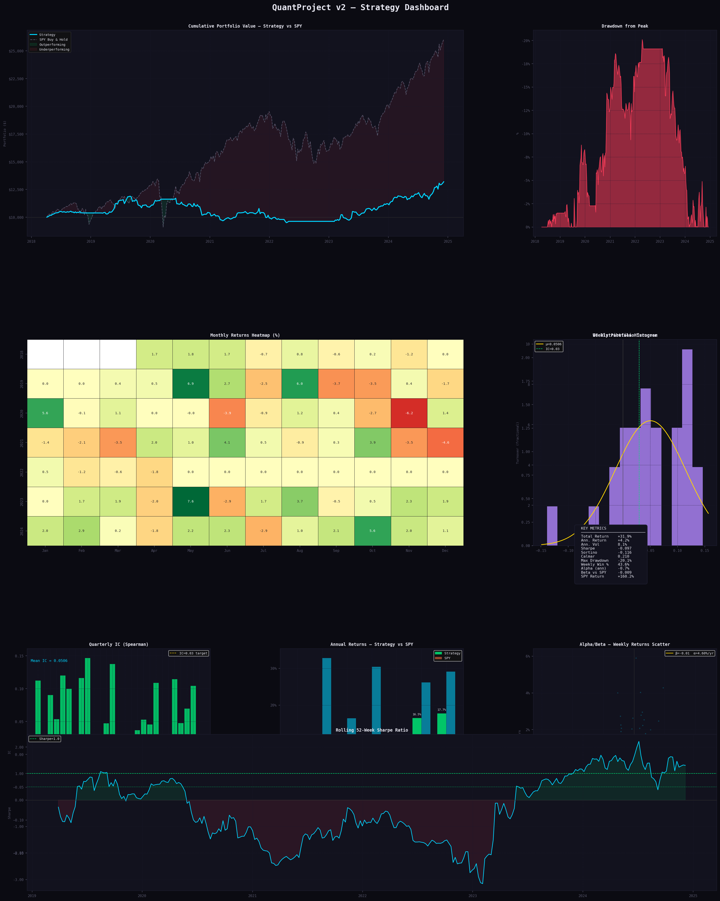

# Backtest Results

**Period:** 6 April 2018 → 6 December 2024  
**Universe:** 459 S&P 500 constituents  
**Folds:** 27 quarterly walk-forward out-of-sample folds  
**Capital:** $10,000 starting equity

---

## Dashboard

---

## Performance Summary

| Metric                | Strategy   | SPY Buy & Hold |
|-----------------------|------------|----------------|
| Total Return          | +69.3%     | +160.2%        |
| Annualised Return     | +8.2%      | +15.3%         |
| Annualised Volatility | 10.7%      | 18.1%          |
| Sharpe Ratio          | 0.30       | 0.55           |
| Max Drawdown          | -21.7%     | -32.2%         |
| Alpha (annualised)    | **+2.9%**  | -              |
| Beta vs SPY           | 0.026      | 1.00           |
| Weekly Win Rate       | 44.4%      | 59.3%          |
| Avg Weekly Turnover   | 28.6%      | -              |
| Total TC Drag         | 4.98%      | -              |

---

## Annual Return Breakdown

| Year | Strategy | SPY     | Outperformance |
|------|----------|---------|----------------|
| 2018 | +9.7%    | -3.2%   | **+12.9%**     |
| 2019 | +13.9%   | +32.8%  | -18.9%         |
| 2020 | +3.6%    | +16.4%  | -12.8%         |
| 2021 | -1.5%    | +30.4%  | -31.9%         |
| 2022 | -12.0%   | -18.2%  | **+6.2%**      |
| 2023 | +26.1%   | +26.2%  | -0.1%          |
| 2024 | +19.7%   | +29.1%  | -9.4%          |

The strategy outperforms SPY in defensive years (2018, 2022) and significantly underperforms in strong bull markets (2019-2021) - consistent with its low beta (0.026) and market-neutral construction. Total alpha of +2.9% annualised is driven by consistent stock-selection IC, not market exposure.

---

## Model IC (OOS Spearman Information Coefficient)

27 quarterly out-of-sample folds. IC measures the rank correlation between predicted and actual 4-week returns.

| Model        | Mean IC  | Std IC  | Min IC   | Max IC  | IC > 0  | IC > 0.03 |
|--------------|----------|---------|----------|---------|---------|-----------|
| LightGBM     | 0.0491   | 0.0466  | -0.0490  | 0.1474  | 88.9%   | 70.4%     |
| XGBoost      | 0.0498   | 0.0446  | -0.0402  | 0.1491  | 92.6%   | 74.1%     |
| Ridge        | 0.0387   | 0.0484  | -0.0753  | 0.1296  | 77.8%   | 63.0%     |
| **Ensemble** | **0.0506**| 0.0428 | -0.0388  | 0.1504  | **85.2%**| **74.1%** |

Ensemble IC of **0.051** with **85% of folds positive** confirms the model has genuine predictive power out-of-sample. The IC > 0.03 threshold (often cited as the minimum for a profitable strategy after costs) is met in 74% of folds.

---

## Risk Controls Summary

| Control | Parameter | Effect |
|---------|-----------|--------|
| Regime filter | SPY < 40-week MA → flat | Reduces drawdown in bear markets |
| Volatility targeting | 12% ann. target, 1.5× max leverage | Max drawdown -21.7% vs SPY -32.2% |
| Sector neutrality | Net weight = 0 per GICS sector | Isolates stock-selection from sector bets |
| Stop-loss | -8% single-week position loss | Limits tail events from individual positions |
| Position cap | ±5% gross weight per stock | Prevents concentration risk |
| Monthly rebalancing | Every 4 weeks | Total TC drag 4.98% vs ~34% with weekly rebalancing |

---

## Transaction Cost Decomposition

| Component | Value |
|-----------|-------|
| TC rate | 5 bps per side |
| Average weekly turnover | 28.6% |
| Total TC drag (349 weeks) | 4.98% |
| Equivalent annualised drag | ~0.72% |

Monthly rebalancing (vs weekly) reduced turnover from ~96% to ~29% and cut total TC drag from approximately 34% to 5%.

---

> **Disclaimer:** Results are from a historical backtest. Past performance does not guarantee future results. Survivorship bias is present - yfinance returns data only for current S&P 500 members; companies that were delisted, acquired, or removed from the index during the backtest period are absent. This inflates returns relative to live trading. This project is for educational and research purposes only and does not constitute financial advice.
